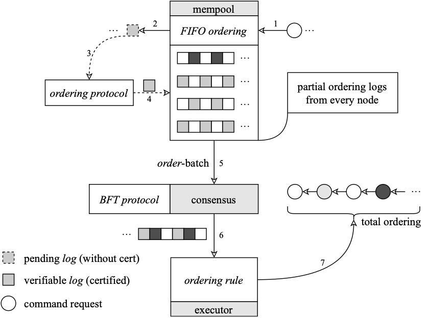
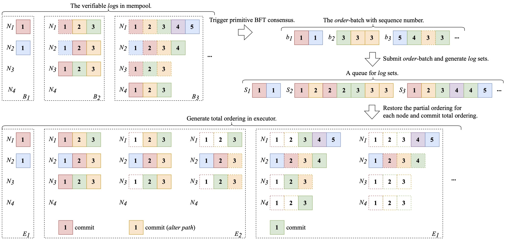

# Phalanx: A Byzantine Fault Tolerant Memory Pool with Fair Ordering

Here's our [technical report (draft)](https://arxiv.org/abs/2209.08512) for the Phalanx protocol. 

## Abstract

Byzantine fault tolerance (BFT) consensus is a fundamental primitive for distributed computation. 
However, BFT protocols suffer from the ordering manipulation, in which an adversary can make front-running. 
Several protocols are proposed to resolve the manipulation problem, but there are some limitations for them. 
The batch-based protocols such as Themis has significant performance loss because of the use of complex algorithms to find strongly connected components (SCCs). 
The timestamp-based protocols such as Pompe have simplified the ordering phase, but they are limited on fairness that the adversary can manipulate the ordering via timestamps of transactions. 
In this paper, we propose a Byzantine ordered consensus protocol called Phalanx, in which transactions are committed by anchor-based ordering strategy. 
The anchor-based strategy makes aggregation of the Lamport logical clock of transactions on each participant and generates the final ordering without complex detection for SCCs. 
Therefore, Phalanx has achieved satisfying performance and performs better in resisting ordering manipulation than timestamp-based strategy.

## Overview

The Phalanx mempool is constructed as following image.

One of the consensus journey as follows.

If you need to start the service for Phalanx, please go into the [bamboo-phalanx](https://github.com/Grivn/bamboo-phalanx) repo, and start the service on [grivn/phalanx-mempool](https://github.com/Grivn/bamboo-phalanx/tree/grivn/phalanx-mempool) branch.

## Note

Any questions please contact us with e-mail (grivn.wang@gmail.com) or propose issues.
